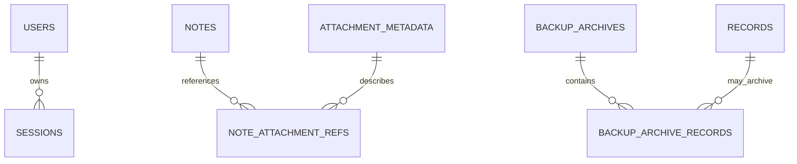

# SQLite Storage Design and Migration

## Relationship Overview

`SESSIONS.username` references `USERS.username` with `ON DELETE CASCADE`. All 17 sessions in the inspected source data match one of the six users. `BACKUP_ARCHIVE_RECORDS.resource` is polymorphic across cleanable resource tables and therefore is not a SQL foreign key.

## Tables

The unified `records` table preserves every original API object in `payload_json`, including report-specific workbook rows and nested structures. Indexed columns are derived only from fields observed in the source data and server logic.

The `records` table replaces all of these resource arrays, discriminated by their allowlisted `resource` value:

- `meetings` replaces `meetings.json`
- `uploads` replaces `uploads.json`
- `notes` replaces `notes.json`
- `cpk` replaces `cpk.json`
- `cumulative` replaces `cumulative.json`
- `active` replaces `active.json`
- `settings` replaces `settings.json`
- `assembly` replaces `assembly.json`
- `monthlyplan` replaces `monthlyplan.json`
- `routecard` replaces `routecard.json`
- `planvsach` replaces `planvsach.json`
- `pdreport` replaces `pdreport.json`
- `prodsummary` replaces `prodsummary.json`
- `maintenancereport` replaces `maintenancereport.json`
- `toolingreport` replaces `toolingreport.json`
- `purchasereport` replaces `purchasereport.json`

`records` has `resource TEXT`, `unit TEXT NOT NULL DEFAULT 'U1'`, `id TEXT`, `created_at INTEGER`, `saved_at INTEGER`, `record_date TEXT`, `month_key TEXT`, `upload_date TEXT`, `meeting_date TEXT`, `shift TEXT`, `anchor_at INTEGER`, `anchor_day TEXT`, `payload_json TEXT`, and generated `sort_at INTEGER`. Its primary key is `(resource, unit, id)`. Resource and unit are CHECK-constrained to code-discovered values; payload is checked with SQLite `json_valid`. Common dates/timestamps remain nullable when absent in source records.

Indexes: `ix_records_lookup(resource, unit, record_date)`, `ix_records_sort(resource, unit, sort_at DESC)`, `ix_records_anchor_day(resource, anchor_day)`, and `ix_records_month(resource, month_key)` support lookups, unit ordering, date ranges, and month filtering.

Other tables:

- `users`: `username TEXT PRIMARY KEY`, `full_name TEXT`, `email TEXT`, `phone TEXT`, `employee_id TEXT`, `password_hash TEXT NOT NULL`, `role TEXT`, `disabled INTEGER NOT NULL DEFAULT 0 CHECK (disabled IN (0,1))`, `created_at INTEGER`, and full `payload_json`. Replaces `users.json`; existing scrypt hashes are copied as-is into `password_hash`; payload also preserves TOTP secrets and access maps. Index: `users_email_lookup(lower(email))`.
- `sessions`: `token TEXT PRIMARY KEY`, `username TEXT NOT NULL REFERENCES users(username) ON DELETE CASCADE`, `at INTEGER`, `payload_json TEXT NOT NULL CHECK (json_valid(payload_json))`. Replaces `sessions.json`. Index: `sessions_username_at(username, at DESC)` for the per-user session cap and revocation.
- `audit_events`: `id TEXT PRIMARY KEY`, `at INTEGER NOT NULL`, `type TEXT NOT NULL`, `username TEXT NOT NULL`, `role TEXT NOT NULL`, `detail TEXT NOT NULL`, `payload_json TEXT NOT NULL CHECK (json_valid(payload_json))`. Replaces `audit.json`; keeps the existing 1,000-event cap. Indexes: `audit_events_at(at DESC)` and `audit_events_username_at(username, at DESC)`.
- `backup_clean_audit`: `id TEXT PRIMARY KEY`, `created_at INTEGER NOT NULL`, `admin_user TEXT`, `action TEXT`, `status TEXT`, `payload_json TEXT NOT NULL CHECK (json_valid(payload_json))`. Replaces `backup-clean-audit.json`; retains the existing 2,000-entry cap. Index: `backup_clean_audit_created(created_at DESC)`.
- `attachment_metadata`: `id TEXT PRIMARY KEY`, `storage_key TEXT NOT NULL UNIQUE`, `name TEXT NOT NULL`, `size INTEGER NOT NULL CHECK (size >= 0)`, `type TEXT NOT NULL`, `by_username TEXT NOT NULL`, `at INTEGER NOT NULL`, `payload_json TEXT NOT NULL CHECK (json_valid(payload_json))`. Replaces `note-files/<id>.json`; the current storage key is the preserved attachment ID and bytes remain in `note-files/<id>.bin` on local disk.
- `note_attachment_refs`: `note_id TEXT NOT NULL`, `unit TEXT NOT NULL`, `attachment_id TEXT NOT NULL`, `position INTEGER NOT NULL`, `file_json TEXT NOT NULL CHECK (json_valid(file_json))`; primary key `(note_id, unit, position)`. Foreign keys `(note_id, unit) -> notes(id, unit) ON DELETE CASCADE` and `attachment_id -> attachment_metadata(id)`. Index: `note_attachment_id(attachment_id)` for reference counting and orphan cleanup.
- `backup_archives`: `file_name TEXT PRIMARY KEY`, `archived_at INTEGER NOT NULL`, `by_username TEXT NOT NULL`, `keep_until INTEGER NOT NULL`, `payload_json TEXT NOT NULL CHECK (json_valid(payload_json))`. Replaces active soft-delete archive headers.
- `backup_archive_records`: `file_name TEXT NOT NULL`, `resource TEXT NOT NULL`, `record_id TEXT NOT NULL`, `unit TEXT NOT NULL`, `deleted_at INTEGER`, `deleted_by TEXT`, `record_json TEXT NOT NULL CHECK (json_valid(record_json))`; primary key `(file_name, resource, record_id, unit)`. Foreign key `file_name -> backup_archives(file_name) ON DELETE CASCADE`. Index: `archive_records_type(resource, unit)`.
- `schema_meta`: `key TEXT PRIMARY KEY`, `value TEXT NOT NULL`; holds the migration completion marker and report.
- `qa_data`: one shared row for the QA workbook's parsed data and upload history. Its JSON payload is stored in SQLite, not in a standalone JSON file.
- `schema_migrations`: `version INTEGER PRIMARY KEY`, `applied_at TEXT NOT NULL`, `purpose TEXT NOT NULL`; versions 1, 2, and 3 are recorded here and in `PRAGMA user_version`.
- `migration_sources`: per-source aggregate counts, issues, snapshot location, and migration time.
- `migration_reconciliation`: per-source/resource/unit counts, missing/unexpected IDs, payload mismatch IDs, source/target date ranges, and match status.

## Important Queries and Transactions

- Resource reads filter by bound `resource` and `unit` and order by generated `sort_at DESC`; updates use `ON CONFLICT(resource, unit, id) DO UPDATE`.
- Retention and Backup Clean use `anchor_at`/`anchor_day` derived from the existing upload date, meeting date, date, month, or saved/created timestamp rules.
- Authentication looks up users by primary-key username and sessions by primary-key token. Session insertion and eviction beyond the newest three are in one transaction.
- Note writes and replacement attachment-reference rows are transactional. Foreign keys are enabled for every connection.
- Account disable/removal, session revocation, and audit removal run in a single transaction.
- Backup Clean archive creation/deletion/restoration is transactional. Attachment files are moved with compensating reverse moves if the database transaction fails.
- All values use prepared statements. Resource table names come only from a fixed allowlist; dynamic user values are parameters.

SQLite is configured with WAL mode, `foreign_keys = ON`, a 5-second busy timeout, and `synchronous = NORMAL`. SQLite serializes writers; WAL allows concurrent readers while a writer commits.

## Migration Flow

Run `npm run migrate:sqlite` or start the server. The migration runs once before routes are mounted:

Before cutover, stop the currently running JSON-backed server so no request can change a source file between the backup and import. Then run `npm run migrate:sqlite` or start the new server.

1. Copy the complete data directory to a sibling `data-migration-backups/<timestamp>/data/`, including JSON, archives, sidecars, caches, and attachment binaries. Add an online SQLite snapshot and verify each file's size and SHA-256; never delete or rewrite source files.
2. Validate expected root shapes, resource IDs, duplicate `(id, unit)` keys, and attachment metadata.
3. Import metadata, all resource payloads, users, sessions, audit entries, cleaner history, and existing archive records inside one SQLite transaction.
4. Compare IDs, complete payloads, counts, and date ranges by resource and unit; reconcile users, sessions, audits, attachments, and archive records. Run `PRAGMA foreign_key_check`.
5. Write machine-readable `migration-report.json` and human-readable `migration-report.txt` in the snapshot directory. Record the success marker only after all checks pass. A failure rolls back and writes a failed report.
6. A subsequent run reports `already_migrated` and performs no duplicate imports.

The report includes per-unit source/target counts, missing/unexpected IDs, payload/date mismatches, imported totals, malformed rows, duplicate keys, foreign-key issues, failed imports, completion time, and snapshot directory. Record payloads are not printed in the report.

## Rollback

Stop the server and retain the verified SQLite bundle. To restore it, run `npm run restore:sqlite -- <bundle-directory> <target-data-directory>` while the target server is stopped. The restore utility checks manifest hashes and SQLite integrity, stages a complete data directory, and renames the replaced directory to a `.pre-restore-*` rollback path. The post-migration cleanup removes the legacy JSON snapshot, so returning to a JSON-backed release requires exporting/reconstructing its expected files from SQLite with a compatible tool. Reconcile writes accepted after the SQLite backup before rollback.

## SQLite Backup

Stop the application server to capture the database and attachment files at one consistent point in time. Run `npm run backup:sqlite -- <backup-root>`; omitting `<backup-root>` writes to a sibling `sqlite-backups` directory. The command uses better-sqlite3's online backup API, copies the complete data directory including attachment binaries, verifies file sizes and SHA-256 hashes, and writes a `manifest.json`. Backup and restore always keep the database and attachments together. Never copy only the main `.db` file while WAL is active.

Schema version 1 created the compatibility tables; version 2 added and backfilled unique `attachment_metadata.storage_key` values from existing attachment IDs; version 3 added the SQLite table for shared QA workbook data and upload history. All versions are recorded in `schema_migrations` and `PRAGMA user_version`. The application upgrades an existing database in place on startup; do not remove the production database to upgrade it.

## Production Cutover Record

Cutover completed on 2 October 2026. The live server at `http://localhost:5180` reads and writes `server/data/morning-meeting.db`; the original migration completed at schema v2 and imported 291 resource records, 6 users, 17 sessions, 1,000 audit events, 2 Backup Clean audit events, and 2 attachment metadata entries. All 93 resource/unit and supplemental reconciliation rows matched; there were no malformed rows, duplicate resource keys, or foreign-key violations. On 4 October 2026, the live legacy files and their copied source JSON records were removed after a fresh check confirmed 71/71 migration reconciliation rows matched, SQLite `integrity_check` returned `ok`, and `foreign_key_check` returned no violations. The same legacy record JSON copies were removed from both SQLite backup bundles; each retained bundle was revalidated and restored successfully. Migration text reports and SQLite backup manifests are retained; the latter are required to validate/restore those bundles.

## Large Payload Benchmark

After migration, run `npm run benchmark:sqlite` (default: five measured runs after one warm-up; use `-- <run-count>` to change the measured run count). It reports record counts, JSON payload bytes, median database-read-plus-JSON-parse time, response-equivalent bytes, and peak observed heap delta by unit for the largest PD Report and Route Card resources. These are local database materialization measurements, not HTTP/network latency. Record the output with the deployment host/runtime details before cutover.

Baseline recorded 2 October 2026 on the current Windows development host with Node.js 24.15.0, using the migrated source-data copy:

- `pdreport` / `U1`: 6 records, 7,871,309 payload bytes; median read+parse 69.992 ms; observed heap delta 16,622,272 bytes.
- `routecard` / `U1`: 2 records, 2,393,152 payload bytes; median read+parse 30.573 ms; observed heap delta 13,887,848 bytes.

These values are a local baseline, not an HTTP SLA; rerun on the factory PC before sign-off.
